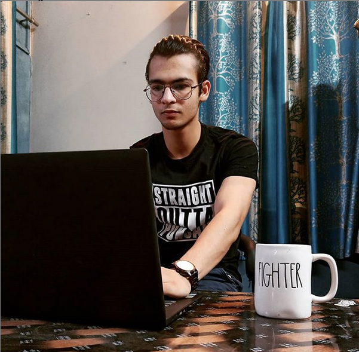

Join me at www.dakshtrehan.com ; www.linkedin.com/in/dakshtrehan

# Tensorflow implementation for CVPR2020 paper “Learning to Cartoonize Using White-box Cartoon Representations.
## It is implementation of [White Box Cartoonization](https://github.com/SystemErrorWang/White-box-Cartoonization) with some minor tweaks.

## Use Cases:
    

______________________________________________________________________________________________________________________________________________________________________
### Copyright Free image downloaded from PixaBay

______________________________________________________________________________________________________________________________________________________________________
### Copyright Free image downloaded from PixaBay

______________________________________________________________________________________________________________________________________________________________________
### Copyright Free image downloaded from PixaBay

______________________________________________________________________________________________________________________________________________________________________
### Copyright Free image downloaded from PixaBay

## How To Use

### Inference with Pre-trained Model

- Store test images in /test_code/test_images
- Run /test_code/cartoonize.py
- Results will be saved in /test_code/cartoonized_images

### Training from Scratch

- Place your training data in corresponding folders in /dataset 
- Run pretrain.py, results will be saved in /pretrain folder
- Run train.py, results will be saved in /train_cartoon folder
- Codes are cleaned from production environment and untested
- There may be minor problems but should be easy to resolve
- Pre-trained VGG_19 model can be found at following url:
https://drive.google.com/file/d/1j0jDENjdwxCDb36meP6-u5xDBzmKBOjJ/view?usp=sharing

### Datasets

- Due to copyright issues, we cannot provide cartoon images used for training.
- However, these training datasets are easy to prepare
- Scenery images are collected from Shinkai Makoto, Miyazaki Hayao and Hosoda Mamoru films
- Clip films into frames and random crop and resize to 256x256
- Portrait images are from Kyoto animations and PA Works
- We use this repo(https://github.com/nagadomi/lbpcascade_animeface) to detect facial areas
- Manual data cleaning will greatly increace both datasets quality

## Citation

If you use this code for your research, please cite [paper](https://systemerrorwang.github.io/White-box-Cartoonization/):

@InProceedings{Wang_2020_CVPR,
author = {Wang, Xinrui and Yu, Jinze},
title = {Learning to Cartoonize Using White-Box Cartoon Representations},
booktitle = {IEEE/CVF Conference on Computer Vision and Pattern Recognition (CVPR)},
month = {June},
year = {2020}
}

# 中文社区

我们有一个除了技术什么东西都聊的以技术交流为主的宇宙超一流二次元相关技术交流吹水群“纸片协会”。如果你一次加群失败，可以多次尝试。

    纸片协会总舵：184467946
